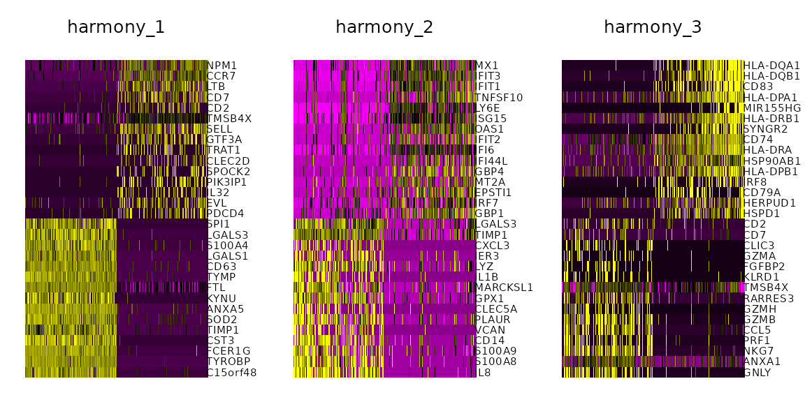

# Using harmony in Seurat

``` r

library(harmony)
library(Seurat)
library(dplyr)
library(cowplot)
```

## Introduction

This tutorial describes how to use harmony in Seurat v5 single-cell
analysis workflows.
[`RunHarmony()`](https://pati-ni.github.io/harmony/reference/RunHarmony.md)
is a generic function is designed to interact with Seurat objects. This
vignette will walkthrough basic workflow of Harmony with Seurat objects.
Also, it will provide some basic downstream analyses demonstrating the
properties of harmonized cell embeddings and a brief explanation of the
exposed algorithm parameters.

Install Harmony from CRAN with standard commands.

``` r

install.packages('harmony')
```

## Generating the dataset

For this demo, we will be aligning two groups of PBMCs [Kang et al.,
2017](https://doi.org/10.1038/nbt.4042). In this experiment, PBMCs are
in stimulated and control conditions. The stimulated PBMC group was
treated with interferon beta.

### Create SeuratObject

``` r

## Source required data
data("pbmc_stim")
pbmc <- CreateSeuratObject(counts = cbind(pbmc.stim, pbmc.ctrl), project = "PBMC", min.cells = 5)

## Separate conditions

pbmc@meta.data$stim <- c(rep("STIM", ncol(pbmc.stim)), rep("CTRL", ncol(pbmc.ctrl)))
```

### (Optional) Download original data

The example above contains only two thousand cells. The full [Kang et
al., 2017](https://doi.org/10.1038/nbt.4042) dataset is deposited in the
[GEO](https://www.ncbi.nlm.nih.gov/geo/query/acc.cgi?acc=GSE96583). This
analysis uses GSM2560248 and GSM2560249 samples from
[GSE96583_RAW.tar](https://www.ncbi.nlm.nih.gov/geo/download/?acc=GSE96583&format=file)
file and the
[GSE96583_batch2.genes.tsv.gz](https://www.ncbi.nlm.nih.gov/geo/download/?acc=GSE96583&format=file&file=GSE96583%5Fbatch2%2Egenes%2Etsv%2Egz)
gene file.

``` r

library(Matrix)
## Download and extract files from GEO
##setwd("/path/to/downloaded/files")
genes =  read.table("GSE96583_batch2.genes.tsv.gz", header = FALSE, sep = "\t")

pbmc.ctrl.full = readMM("GSM2560248_2.1.mtx.gz")
colnames(pbmc.ctrl.full) = paste0(read.table("GSM2560248_barcodes.tsv.gz", header = FALSE, sep = "\t")[,1], "-1")
rownames(pbmc.ctrl.full) = genes$V1

pbmc.stim.full = readMM("GSM2560249_2.2.mtx.gz")
colnames(pbmc.stim.full) = paste0(read.table("GSM2560249_barcodes.tsv.gz", header = FALSE, sep = "\t")[,1], "-2")
rownames(pbmc.stim.full) = genes$V1

library(Seurat)

pbmc <- CreateSeuratObject(counts = cbind(pbmc.stim.full, pbmc.ctrl.full), project = "PBMC", min.cells = 5)
pbmc@meta.data$stim <- c(rep("STIM", ncol(pbmc.stim.full)), rep("CTRL", ncol(pbmc.ctrl.full)))
```

## Running Harmony

Harmony works on an existing matrix with cell embeddings and outputs its
transformed version with the datasets aligned according to some
user-defined experimental conditions. By default, harmony will look up
the `pca` cell embeddings and use these to run harmony. Therefore, it
assumes that the Seurat object has these embeddings already precomputed.

### Calculate PCA cell embeddings

Here, using
[`Seurat::NormalizeData()`](https://satijalab.org/seurat/reference/NormalizeData.html),
we will be generating a union of highly variable genes using each
condition (the control and stimulated cells). These features are going
to be subsequently used to generate the 20 PCs with
[`Seurat::RunPCA()`](https://satijalab.org/seurat/reference/RunPCA.html).

``` r

pbmc <- pbmc %>%
    NormalizeData(verbose = FALSE)

VariableFeatures(pbmc) <- split(row.names(pbmc@meta.data), pbmc@meta.data$stim) %>% lapply(function(cells_use) {
    pbmc[,cells_use] %>%
        FindVariableFeatures(selection.method = "vst", nfeatures = 2000) %>% 
        VariableFeatures()
}) %>% unlist %>% unique
#> Finding variable features for layer counts
#> Finding variable features for layer counts

pbmc <- pbmc %>% 
    ScaleData(verbose = FALSE) %>% 
    RunPCA(features = VariableFeatures(pbmc), npcs = 20, verbose = FALSE)
```

### Perform an integrated analysis using harmony

To run harmony on Seurat object after it has been normalized, only one
argument needs to be specified which contains the batch covariate
located in the metadata. For this vignette, further parameters are
specified to align the dataset but the minimum parameters are shown in
the snippet below:

``` r

## run harmony with default parameters
pbmc <- pbmc %>% RunHarmony("stim")
## is equivalent to:
pbmc <- RunHarmony(pbmc, "stim")
```

Here, we will be running harmony with some indicative parameters and
plotting the convergence plot to illustrate some of the under the hood
functionality.

``` r


pbmc <- pbmc %>% 
    RunHarmony("stim", plot_convergence = TRUE, nclust = 50, max_iter = 10, early_stop = T)
#> Transposing data matrix
#> Using automatic lambda estimation
#> Thetas: 2
#> Initializing state using k-means centroids initialization
#> Initializing centroids
#> Harmony 1/10
#> Harmony 2/10
#> Harmony 3/10
#> Harmony 4/10
#> Harmony 5/10
#> Harmony 6/10
#> Harmony 7/10
#> Harmony 8/10
#> Harmony converged after 8 iterations
```


By setting `plot_converge=TRUE`, harmony will generate a plot with its
objective showing the flow of the integration. Each point represents the
cost measured after a clustering round. Different colors represent
different Harmony iterations which is controlled by `max_iter` (assuming
that early_stop=FALSE). Here `max_iter=10` and up to 10 correction steps
are expected. However, `early_stop=TRUE` so harmony will stop after the
cost plateaus.

## Harmony API parameters on Seurat objects

`RunHarmony` has several parameters accessible to users which are
outlined below.

##### `object` (required)

The Seurat object. This vignette assumes Seurat objects are version 5.

##### `group.by.vars` (required)

A character vector that specifies all the experimental covariates to be
corrected/harmonized by the algorithm.

When using
[`RunHarmony()`](https://pati-ni.github.io/harmony/reference/RunHarmony.md)
with Seurat, harmony will look up the `group.by.vars` metadata fields in
the Seurat Object metadata.

For example, given the `pbmc[["stim"]]` exists as the stim condition,
setting `group.by.vars="stim"` will perform integration of these samples
accordingly. If you want to integrate on another variable, it needs to
be present in Seurat object’s meta.data.

To correct for several covariates, specify them in a vector:
`group.by.vars = c("stim", "new_covariate")`.

##### `reduction.use`

The cell embeddings to be used for the batch alignment. This parameter
assumes that a reduced dimension already exists in the reduction slot of
the Seurat object. By default, the `pca` reduction is used.

##### `dims.use`

Optional parameter which can use a name vector to select specific
dimensions to be harmonized.

#### Algorithm parameters


Harmony Algorithm Overview

##### `nclust`

is a positive integer. Under the hood, harmony applies k-means
soft-clustering. For this task, `k` needs to be determined. `nclust`
corresponds to `k`. The harmonization results and performance are not
particularly sensitive for a reasonable range of this parameter value.
If this parameter is not set, harmony will autodetermine this based on
the dataset size with a maximum cap of 200. For dataset with a vast
amount of different cell types and batches this pamameter may need to be
determined manually.

##### `sigma`

a positive scalar that controls the soft clustering probability
assignment of single-cells to different clusters. Larger values will
assign a larger probability to distant clusters of cells resulting in a
different correction profile. Single-cells are assigned to clusters by
their euclidean distance $`d`$ to some cluster center $`Y`$ after cosine
normalization which is defined in the range \[0,4\]. The clustering
probability of each cell is calculated as $`e^{-\frac{d}{\sigma}}`$
where $`\sigma`$ is controlled by the `sigma` parameter. Default value
of `sigma` is 0.1 and it generally works well since it defines
probability assignment of a cell in the range $`[e^{-40}, e^0]`$. Larger
values of `sigma` restrict the dynamic range of probabilities that can
be assigned to cells. For example, `sigma=1` will yield a probabilities
in the range of $`[e^{-4}, e^0]`$.

##### `theta`

`theta` is a positive scalar vector that determines the coefficient of
harmony’s diversity penalty for each corrected experimental covariate.
In challenging experimental conditions, increasing theta may result in
better integration results. Theta is an expontential parameter of the
diversity penalty, thus setting `theta=0` disables this penalty while
increasing it to greater values than 1 will perform more aggressive
corrections in an expontential manner. By default, it will set `theta=2`
for each experimental covariate.

##### `max_iter`

The number of correction steps harmony will perform before completing
the data set integration. In general, more iterations than necessary
increases computational runtime especially which becomes evident in
bigger datasets. Setting `early_stop=TRUE` may reduce the actual number
of correction steps which will be smaller than `max_iter`.

##### `early_stop`

Under the hood, harmony minimizes its objective function through a
series of clustering and integration tests. By setting
`early_stop=TRUE`, when the objective function is less than `1e-4` after
a correction step harmony exits before reaching the `max_iter`
correction steps. This parameter can drastically reduce run-time in
bigger datasets.

##### `.options`

A set of internal algorithm parameters that can be overriden. For
advanced users only.

#### Seurat specific parameters

These parameters are Seurat-specific and do not affect the flow of the
algorithm.

##### `project.dim`

Toggle-like parameter, by default `project.dim=TRUE`. When enabled,
[`RunHarmony()`](https://pati-ni.github.io/harmony/reference/RunHarmony.md)
calculates genomic feature loadings using Seurat’s
[`ProjectDim()`](https://satijalab.org/seurat/reference/ProjectDim.html)
that correspond to the harmonized cell embeddings.

##### `reduction.save`

The new Reduced Dimension slot identifier. By default,
`reduction.save="harmony"`. This option allows several independent runs
of harmony to be retained in the appropriate slots in the SeuratObjects.
It is useful if you want to try Harmony with multiple parameters and
save them as e.g. ‘harmony_theta0’, ‘harmony_theta1’, ‘harmony_theta2’.

#### Miscellaneous parameters

These parameters help users troubleshoot harmony.

##### `plot_convergence`

Option that plots the convergence plot after the execution of the
algorithm. By default `FALSE`. Setting it to `TRUE` will collect
harmony’s objective value and plot it allowing the user to troubleshoot
the flow of the algorithm and fine-tune the parameters of the dataset
integration procedure.

#### Accessing the data

[`RunHarmony()`](https://pati-ni.github.io/harmony/reference/RunHarmony.md)
returns the Seurat object which contains the harmonized cell embeddings
in a slot named **harmony**. This entry can be accessed via
`pbmc@reductions$harmony`. To access the values of the cell embeddings
we can also use:

``` r

harmony.embeddings <- Embeddings(pbmc, reduction = "harmony")
```

\#Visualize harmony results

After Harmony integration, we should inspect the quality of the
harmonization and contrast it with the unharmonized algorithm input.
Ideally, cells from different conditions will align along the Harmonized
PCs. If they are not, you could increase the *theta* value above to
force a more aggressive fit of the dataset and rerun the workflow.

``` r


p1 <- DimPlot(object = pbmc, reduction = "harmony", pt.size = .1, group.by = "stim")
p2 <- VlnPlot(object = pbmc, features = "harmony_1", group.by = "stim",  pt.size = .1)
plot_grid(p1,p2)
```


Evaluate harmonization of stim parameter in the harmony generated cell
embeddings

Plot Genes correlated with the Harmonized PCs

``` r


DimHeatmap(object = pbmc, reduction = "harmony", cells = 500, dims = 1:3)
```



## Using harmony embeddings for dimensionality reduction in Seurat

The harmonized cell embeddings generated by harmony can be used for
further integrated analyses. In this workflow, the Seurat object
contains the harmony `reduction` modality name in the method that
requires it.

### Perform clustering using the harmonized vectors of cells

``` r

pbmc <- pbmc %>%
    FindNeighbors(reduction = "harmony") %>%
    FindClusters(resolution = 0.5) 
#> Computing nearest neighbor graph
#> Computing SNN
#> Modularity Optimizer version 1.3.0 by Ludo Waltman and Nees Jan van Eck
#> 
#> Number of nodes: 2000
#> Number of edges: 70985
#> 
#> Running Louvain algorithm...
#> Maximum modularity in 10 random starts: 0.8701
#> Number of communities: 10
#> Elapsed time: 0 seconds
```

### TSNE dimensionality reduction

``` r

pbmc <- pbmc %>%
    RunTSNE(reduction = "harmony")


p1 <- DimPlot(pbmc, reduction = "tsne", group.by = "stim", pt.size = .1)
p2 <- DimPlot(pbmc, reduction = "tsne", label = TRUE, pt.size = .1)
plot_grid(p1, p2)
```


t-SNE Visualization of harmony embeddings

One important observation is to assess that the harmonized data contain
biological states of the cells. Therefore by checking the following
genes we can see that biological cell states are preserved after
harmonization.

``` r

FeaturePlot(object = pbmc, features= c("CD3D", "SELL", "CREM", "CD8A", "GNLY", "CD79A", "FCGR3A", "CCL2", "PPBP"), 
            min.cutoff = "q9", cols = c("lightgrey", "blue"), pt.size = 0.5)
```


Expression of gene panel heatmap in the harmonized PBMC dataset

### UMAP

Very similarly with TSNE we can run UMAP by passing the harmony
reduction in the function.

``` r

pbmc <- pbmc %>%
    RunUMAP(reduction = "harmony",  dims = 1:20)
#> Warning: The default method for RunUMAP has changed from calling Python UMAP via reticulate to the R-native UWOT using the cosine metric
#> To use Python UMAP via reticulate, set umap.method to 'umap-learn' and metric to 'correlation'
#> This message will be shown once per session
#> 18:48:39 UMAP embedding parameters a = 0.9922 b = 1.112
#> 18:48:39 Read 2000 rows and found 20 numeric columns
#> 18:48:39 Using Annoy for neighbor search, n_neighbors = 30
#> 18:48:39 Building Annoy index with metric = cosine, n_trees = 50
#> 0%   10   20   30   40   50   60   70   80   90   100%
#> [----|----|----|----|----|----|----|----|----|----|
#> **************************************************|
#> 18:48:39 Writing NN index file to temp file /tmp/RtmpJEcoMr/file3b6dd487c8e0
#> 18:48:39 Searching Annoy index using 1 thread, search_k = 3000
#> 18:48:40 Annoy recall = 100%
#> 18:48:40 Commencing smooth kNN distance calibration using 1 thread with target n_neighbors = 30
#> 18:48:40 Initializing from normalized Laplacian + noise (using RSpectra)
#> 18:48:40 Commencing optimization for 500 epochs, with 83016 positive edges
#> 18:48:40 Using rng type: pcg
#> 18:48:42 Optimization finished

p1 <- DimPlot(pbmc, reduction = "umap", group.by = "stim", pt.size = .1)
p2 <- DimPlot(pbmc, reduction = "umap", label = TRUE,  pt.size = .1)
plot_grid(p1, p2)
```


UMAP Visualization of harmony embeddings

``` r

sessionInfo()
#> R version 4.5.2 (2025-10-31)
#> Platform: x86_64-conda-linux-gnu
#> Running under: Arch Linux
#> 
#> Matrix products: default
#> BLAS/LAPACK: /home/main/miniconda3/envs/R2026/lib/libopenblasp-r0.3.30.so;  LAPACK version 3.12.0
#> 
#> locale:
#>  [1] LC_CTYPE=en_US.UTF-8       LC_NUMERIC=C              
#>  [3] LC_TIME=en_US.UTF-8        LC_COLLATE=en_US.UTF-8    
#>  [5] LC_MONETARY=en_US.UTF-8    LC_MESSAGES=en_US.UTF-8   
#>  [7] LC_PAPER=en_US.UTF-8       LC_NAME=C                 
#>  [9] LC_ADDRESS=C               LC_TELEPHONE=C            
#> [11] LC_MEASUREMENT=en_US.UTF-8 LC_IDENTIFICATION=C       
#> 
#> time zone: America/New_York
#> tzcode source: system (glibc)
#> 
#> attached base packages:
#> [1] stats     graphics  grDevices utils     datasets  methods   base     
#> 
#> other attached packages:
#> [1] future_1.69.0      cowplot_1.2.0      dplyr_1.1.4        Seurat_5.4.0      
#> [5] SeuratObject_5.3.0 sp_2.2-0           harmony_2.0.0      Rcpp_1.1.1        
#> 
#> loaded via a namespace (and not attached):
#>   [1] deldir_2.0-4           pbapply_1.7-4          gridExtra_2.3         
#>   [4] rlang_1.1.7            magrittr_2.0.4         RcppAnnoy_0.0.23      
#>   [7] otel_0.2.0             spatstat.geom_3.7-0    matrixStats_1.5.0     
#>  [10] ggridges_0.5.7         compiler_4.5.2         png_0.1-8             
#>  [13] systemfonts_1.3.1      vctrs_0.7.1            reshape2_1.4.5        
#>  [16] stringr_1.6.0          pkgconfig_2.0.3        fastmap_1.2.0         
#>  [19] labeling_0.4.3         promises_1.5.0         rmarkdown_2.30        
#>  [22] ggbeeswarm_0.7.3       ragg_1.5.0             purrr_1.2.1           
#>  [25] xfun_0.56              cachem_1.1.0           jsonlite_2.0.0        
#>  [28] goftest_1.2-3          later_1.4.5            spatstat.utils_3.2-1  
#>  [31] irlba_2.3.5.1          parallel_4.5.2         cluster_2.1.8.1       
#>  [34] R6_2.6.1               ica_1.0-3              spatstat.data_3.1-9   
#>  [37] bslib_0.9.0            stringi_1.8.7          RColorBrewer_1.1-3    
#>  [40] reticulate_1.44.1      spatstat.univar_3.1-6  parallelly_1.46.1     
#>  [43] lmtest_0.9-40          jquerylib_0.1.4        scattermore_1.2       
#>  [46] knitr_1.51             tensor_1.5.1           future.apply_1.20.1   
#>  [49] zoo_1.8-15             sctransform_0.4.3      httpuv_1.6.16         
#>  [52] Matrix_1.7-4           splines_4.5.2          igraph_2.1.4          
#>  [55] tidyselect_1.2.1       abind_1.4-8            yaml_2.3.12           
#>  [58] spatstat.random_3.4-4  spatstat.explore_3.7-0 codetools_0.2-20      
#>  [61] miniUI_0.1.2           listenv_0.10.0         plyr_1.8.9            
#>  [64] lattice_0.22-7         tibble_3.3.1           withr_3.0.2           
#>  [67] shiny_1.12.1           S7_0.2.1               ROCR_1.0-12           
#>  [70] ggrastr_1.0.2          evaluate_1.0.5         Rtsne_0.17            
#>  [73] fastDummies_1.7.5      desc_1.4.3             survival_3.8-6        
#>  [76] polyclip_1.10-7        fitdistrplus_1.2-6     pillar_1.11.1         
#>  [79] KernSmooth_2.23-26     plotly_4.12.0          generics_0.1.4        
#>  [82] RcppHNSW_0.6.0         ggplot2_4.0.1          scales_1.4.0          
#>  [85] globals_0.18.0         xtable_1.8-4           RhpcBLASctl_0.23-42   
#>  [88] glue_1.8.0             lazyeval_0.2.2         tools_4.5.2           
#>  [91] data.table_1.17.8      RSpectra_0.16-2        RANN_2.6.2            
#>  [94] fs_1.6.6               dotCall64_1.2          grid_4.5.2            
#>  [97] tidyr_1.3.2            nlme_3.1-168           patchwork_1.3.2       
#> [100] beeswarm_0.4.0         vipor_0.4.7            cli_3.6.5             
#> [103] spatstat.sparse_3.1-0  textshaping_1.0.4      spam_2.11-3           
#> [106] viridisLite_0.4.2      uwot_0.2.4             gtable_0.3.6          
#> [109] sass_0.4.10            digest_0.6.39          progressr_0.18.0      
#> [112] ggrepel_0.9.6          htmlwidgets_1.6.4      farver_2.1.2          
#> [115] htmltools_0.5.9        pkgdown_2.2.0          lifecycle_1.0.5       
#> [118] httr_1.4.7             mime_0.13              MASS_7.3-65
```
