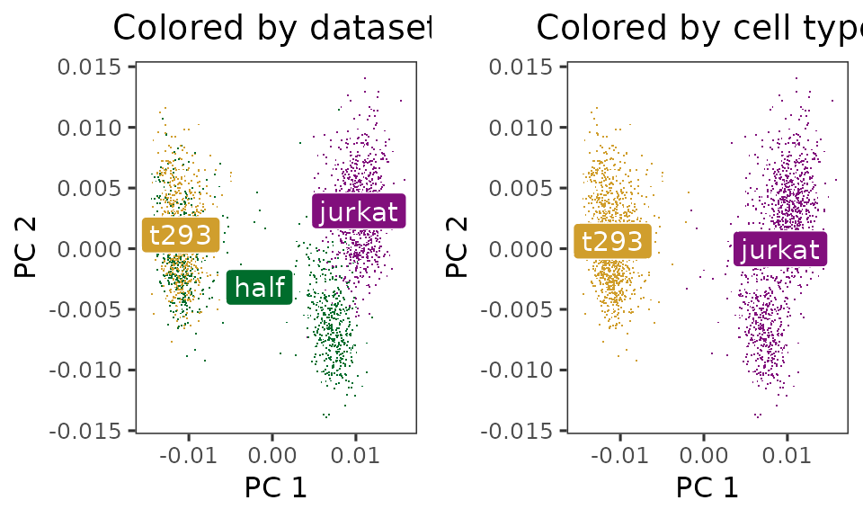
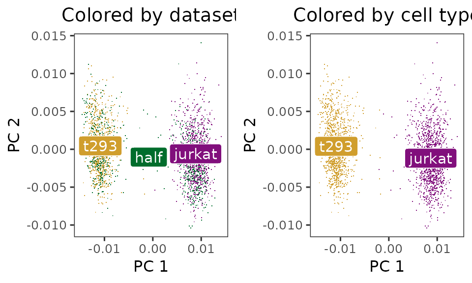

# Quick start to Harmony

## Introduction

Harmony is an algorithm for performing integration of single cell
genomics datasets. Please check out our latest [manuscript on Nature
Methods](https://www.nature.com/articles/s41592-019-0619-0).


## Installation

Install Harmony from CRAN with standard commands.

``` r

install.packages('harmony')
```

Once Harmony is installed, load it up!

``` r

library(harmony)
```

    ## Loading required package: Rcpp

## Integrating cell line datasets from 10X

The example below follows Figure 2 in the manuscript.

We downloaded 3 cell line datasets from the 10X website. The first two
(jurkat and 293t) come from pure cell lines while the *half* dataset is
a 50:50 mixture of Jurkat and HEK293T cells. We inferred cell type with
the canonical marker XIST, since the two cell lines come from 1 male and
1 female donor.

- support.10xgenomics.com/single-cell-gene-expression/datasets/1.1.0/jurkat
- support.10xgenomics.com/single-cell-gene-expression/datasets/1.1.0/293t
- support.10xgenomics.com/single-cell-gene-expression/datasets/1.1.0/jurkat:293t_50:50

We library normalized the cells, log transformed the counts, and scaled
the genes. Then we performed PCA and kept the top 20 PCs. The PCA
embeddings and meta data are available as part of this package.

``` r

data(cell_lines)
V <- cell_lines$scaled_pcs
meta_data <- cell_lines$meta_data
```

Initially, the cells cluster by both dataset (left) and cell type
(right).

``` r

library(ggplot2)

do_scatter <- function(xy, meta_data, label_name, base_size = 12) {    
    palette_use <- c(`jurkat` = '#810F7C', `t293` = '#D09E2D',`half` = '#006D2C')
    xy <- xy[, 1:2]
    colnames(xy) <- c('X1', 'X2')
    plt_df <- xy %>% data.frame() %>% cbind(meta_data)
    plt <- ggplot(plt_df, aes(X1, X2, col = !!rlang::sym(label_name), fill = !!rlang::sym(label_name))) + 
        theme_test(base_size = base_size) +
        guides(color = guide_legend(override.aes = list(stroke = 1, alpha = 1,
                                                        shape = 16, size = 4))) +
        scale_color_manual(values = palette_use) +
        scale_fill_manual(values = palette_use) +
        theme(plot.title = element_text(hjust = .5)) +
        labs(x = "PC 1", y = "PC 2") +
        theme(legend.position = "none") +
        geom_point(shape = '.')
    
    ## Add labels
    data_labels <- plt_df %>%
        dplyr::group_by(!!rlang::sym(label_name)) %>%
        dplyr::summarise(X1 = mean(X1), X2 = mean(X2)) %>%
        dplyr::ungroup()
    plt + geom_label(data = data_labels, aes(label = !!rlang::sym(label_name)), 
                            color = "white", size = 4)
}
p1 <- do_scatter(V, meta_data, 'dataset') + 
    labs(title = 'Colored by dataset')
p2 <- do_scatter(V, meta_data, 'cell_type') + 
    labs(title = 'Colored by cell type')

cowplot::plot_grid(p1, p2)
```



Let’s run Harmony to remove the influence of dataset-of-origin from the
cell embeddings.

``` r

harmony_embeddings <- harmony::RunHarmony(
    V, meta_data, 'dataset', verbose=FALSE
)
```

After Harmony, the datasets are now mixed (left) and the cell types are
still separate (right).

``` r

p1 <- do_scatter(harmony_embeddings, meta_data, 'dataset') + 
    labs(title = 'Colored by dataset')
p2 <- do_scatter(harmony_embeddings, meta_data, 'cell_type') + 
    labs(title = 'Colored by cell type')
cowplot::plot_grid(p1, p2, nrow = 1)
```



## Next Steps

### Interfacing to software packages

You can also run Harmony as part of an established pipeline in several
packages, such as Seurat. For these vignettes, please [visit our github
page](https://github.com/immunogenomics/harmony/).

### Detailed breakdown of the Harmony algorithm

For more details on how each part of Harmony works, consult our more
detailed
[vignette](https://htmlpreview.github.io/?https://github.com/immunogenomics/harmony/blob/master/doc/detailedWalkthrough.html)
“Detailed Walkthrough of Harmony Algorithm”.

## Session Info

``` r

sessionInfo()
```

    ## R version 4.5.2 (2025-10-31)
    ## Platform: x86_64-conda-linux-gnu
    ## Running under: Arch Linux
    ## 
    ## Matrix products: default
    ## BLAS/LAPACK: /home/main/miniconda3/envs/R2026/lib/libopenblasp-r0.3.30.so;  LAPACK version 3.12.0
    ## 
    ## locale:
    ##  [1] LC_CTYPE=en_US.UTF-8       LC_NUMERIC=C              
    ##  [3] LC_TIME=en_US.UTF-8        LC_COLLATE=en_US.UTF-8    
    ##  [5] LC_MONETARY=en_US.UTF-8    LC_MESSAGES=en_US.UTF-8   
    ##  [7] LC_PAPER=en_US.UTF-8       LC_NAME=C                 
    ##  [9] LC_ADDRESS=C               LC_TELEPHONE=C            
    ## [11] LC_MEASUREMENT=en_US.UTF-8 LC_IDENTIFICATION=C       
    ## 
    ## time zone: America/New_York
    ## tzcode source: system (glibc)
    ## 
    ## attached base packages:
    ## [1] stats     graphics  grDevices utils     datasets  methods   base     
    ## 
    ## other attached packages:
    ## [1] ggplot2_4.0.1 harmony_2.0.0 Rcpp_1.1.1   
    ## 
    ## loaded via a namespace (and not attached):
    ##  [1] Matrix_1.7-4        gtable_0.3.6        jsonlite_2.0.0     
    ##  [4] dplyr_1.1.4         compiler_4.5.2      tidyselect_1.2.1   
    ##  [7] jquerylib_0.1.4     systemfonts_1.3.1   scales_1.4.0       
    ## [10] textshaping_1.0.4   RhpcBLASctl_0.23-42 yaml_2.3.12        
    ## [13] fastmap_1.2.0       lattice_0.22-7      R6_2.6.1           
    ## [16] labeling_0.4.3      generics_0.1.4      knitr_1.51         
    ## [19] htmlwidgets_1.6.4   tibble_3.3.1        desc_1.4.3         
    ## [22] bslib_0.9.0         pillar_1.11.1       RColorBrewer_1.1-3 
    ## [25] rlang_1.1.7         cachem_1.1.0        xfun_0.56          
    ## [28] fs_1.6.6            sass_0.4.10         S7_0.2.1           
    ## [31] otel_0.2.0          cli_3.6.5           withr_3.0.2        
    ## [34] pkgdown_2.2.0       magrittr_2.0.4      digest_0.6.39      
    ## [37] grid_4.5.2          cowplot_1.2.0       lifecycle_1.0.5    
    ## [40] vctrs_0.7.1         evaluate_1.0.5      glue_1.8.0         
    ## [43] farver_2.1.2        codetools_0.2-20    ragg_1.5.0         
    ## [46] rmarkdown_2.30      tools_4.5.2         pkgconfig_2.0.3    
    ## [49] htmltools_0.5.9
